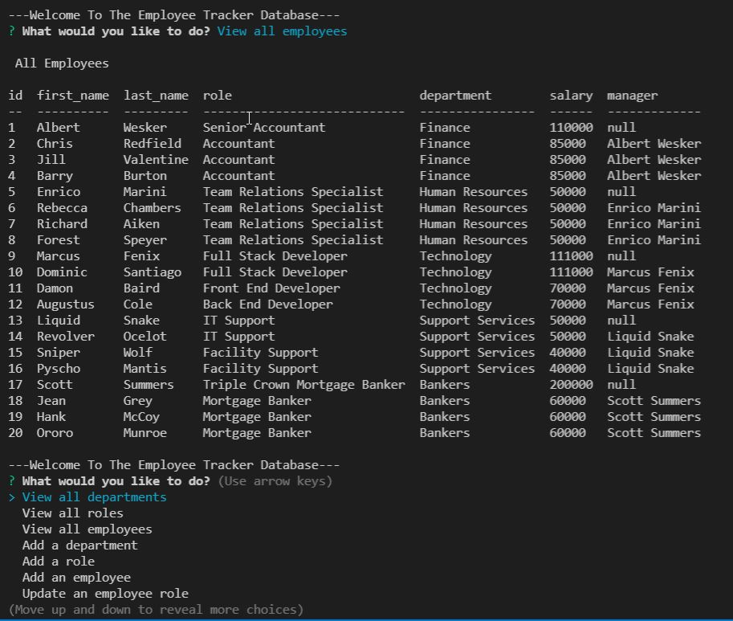

# Challenge 12: The Employee Tracker

## Description
A Javascript program to query an SQL database with employee information.

* Javascript
* Node.js including the following packages:
  * Inquirer
  * MySQL2
  * Console.table
* MySQL

## Screenshot
</img>

## Demonstration Video
                      
## Installation
Navigate to the folder containing server.js and run "npm start" in the terminal. Must have NPM packages, Inquirer, MySQL2 and console.table installed.

## Usage
Query a database of employee names, roles, departments and salary.

